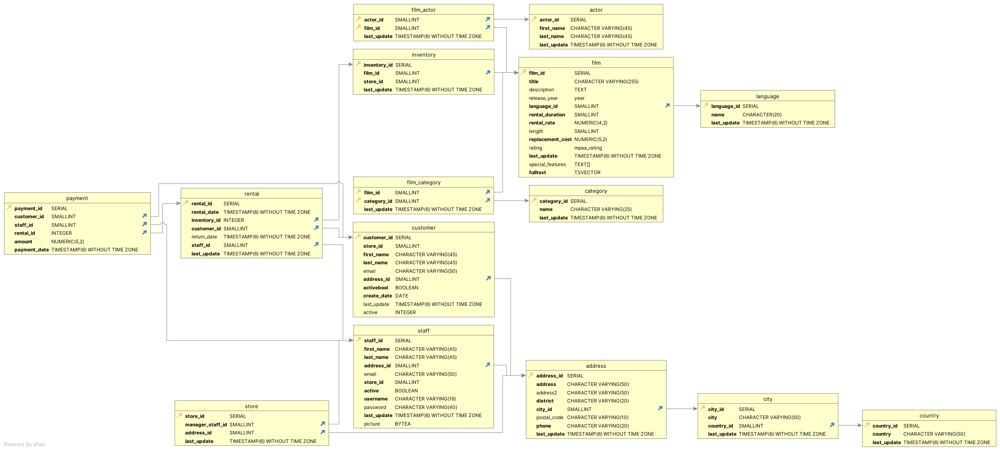

# Portfolio - SQL skills
## Overview
This project was to demonstrate a series of SQL queries written as part of the test business scenario given. The actual SQL queries written to address the business questions in this scenario are uploaded as files in this project folders. Please refer below for the business scenario used to create these queries:

## Business Scenario
**Introduction** 
Rockbuster Stealth LLC is a movie rental company that used to have stores around the world. Facing stiff competition from streaming services such as Netflix and Amazon Prime, the Rockbuster Stealth management team is planning to use its existing movie licenses to launch an online video rental service in order to stay competitive.  
You’ve been hired as a data analyst by Rockbuster Stealth’s business intelligence (BI) department to help with the launch strategy for the new online video service. The BI department helps other departments, from inventory to customer insights, with data-related queries. Your first task is to load all of Rockbuster’s data into a relational database management system (RDBMS). Then, you’ll use SQL to analyze the data and answer any ad-hoc business questions that other departments may have.

**Key Questions and Objectives** 
The Rockbuster Stealth Management Board has asked a series of business questions and they expect data-driven answers that they can use for their 2020 company strategy. Here are the main questions they’d like to answer: 
● Which movies contributed the most/least to revenue gain? 
● What was the average rental duration for all videos? 
● Which countries are Rockbuster customers based in? 
● Where are customers with a high lifetime value based? 
● Do sales figures vary between geographic regions? 

**Data Set and Data structure** 
A dataset compromising the following tables and columns were analyzed to develop queries (in the format of Table Name - Column Name 1, Column Name 2...): 
● payment - payment_id, customer_id, staff_id, rental_id, amount, payment_date 
● rental_id - rental_date, inventory_id, customer_id, return_date, staff_id, last_update 
● store_id - manager_staff_id, address_id, last_update 
● actor_id - film_id, last_update 
● inventory_id - film_id, store_id, last_update 
● film_id - category_id, last_update 
● customer_id - store_id, first_name, last_name, email, address_id, activebool, created_date, active 
● staff_id - first_name, last_name, address_id, email, store_id, active, username, last_update, picture 
● actor_id - first_name, last_name, last_update 
● film_id - title, description, release_year, language_id, rental_duration, rental_rate, length, rating, last_update, special_features 
● category_id - name, last_update 
● address_id - address, address2, district, city_id, postal_code, phone, last_update 
● language_id - name, last_update 
● city_id - city, country_id, last_update 
● country_id - country, last_update  
 

## Final Product
The dataset analyzed using the SQL queries were visually summarized using Tableau dashboards. Please click the link below for the final product (click different tabs for visualizations created)  
Link: [Tableau Dashboard](https://public.tableau.com/views/CF_DI_E310_1/Customer_Base?:language=en-US&:display_count=n&:origin=viz_share_link)
